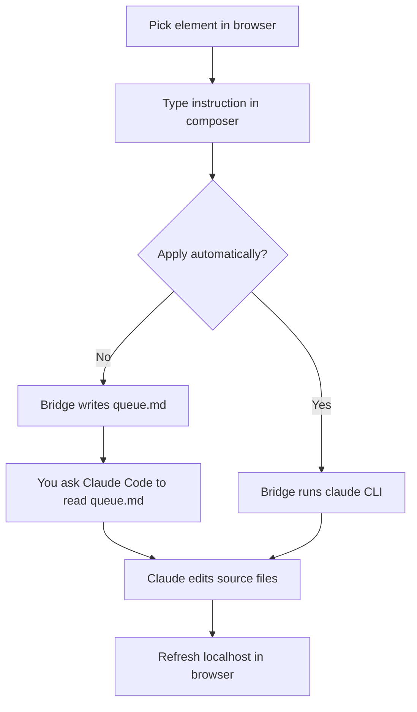

# Visidi

**VIbey SIte DIrector** — click any element on your local dev site, describe
what you want changed, and get a structured edit prompt for AI coding agents
(Claude Code, Codex, Cursor, etc.).

Visidi has two parts that run **entirely on your machine**:

| Part | Install | What it does |
|------|---------|----------------|
| **Chrome extension** | [Chrome Web Store](https://chromewebstore.google.com/) (search **Visidi**) | Pick elements on `localhost` pages and capture edit instructions |
| **Bridge CLI** | `npx visidi-bridge` — [npm](https://www.npmjs.com/package/visidi-bridge) | Receives captures and writes `.vibe-edits/queue.md` (optional auto-apply via `claude`) |

The extension only works on **local dev sites** — `localhost`, `127.0.0.1`,
and `file://` HTML files. It does not run on deployed production URLs.

**Current release:** extension `0.2.0` · bridge [`visidi-bridge@0.2.0`](https://www.npmjs.com/package/visidi-bridge)

---

## Quick start (production users)

You do **not** need to clone this repo.

### 1. Install the Chrome extension

Install **Visidi** from the [Chrome Web Store](https://chromewebstore.google.com/)
(search for “Visidi” by Brendan Beh / eigenfn).

Then pin it to your toolbar (puzzle icon → pin).

If you use local HTML files (`file://`), open `chrome://extensions`, find
Visidi, and enable **Allow access to file URLs**.

### 2. Start the bridge (and your dev server)

In a terminal, `cd` to the **project you want to edit** (your app’s repo root):

```bash
cd /path/to/your/project
npx visidi-bridge --dev -- npm run dev
```

`--dev -- npm run dev` runs your dev server as part of the same command
(prefixed `[dev]` in the output) — one terminal instead of two. Leave it
running. You should see:

```
[visidi-bridge] Running on ws://localhost:4017
[visidi-bridge] Queue file: /path/to/your/project/.vibe-edits/queue.md
[dev] ...your dev server's own output...
```

`Ctrl+C` stops both. If your dev server crashes, the bridge shuts down
too — just restart the same command.

Drop the `-- npm run dev` part to auto-detect from your `package.json`'s
`"dev"` script (falls back to `"start"`):

```bash
npx visidi-bridge --dev
```

Prefer two separate terminals (e.g. to scroll dev-server output
independently)? `npx visidi-bridge` on its own still works exactly as
before — just run your dev server separately.

> Run the bridge from your **app’s project root** — that’s where `queue.md`
> is created and where auto-apply edits source files.

Optional: pin the bridge version in a project:

```bash
npm install --save-dev visidi-bridge
# package.json → "scripts": { "visidi": "visidi-bridge --dev" }
```

### 3. Open your local dev site

Already running from step 2 if you used `--dev`. Otherwise:

```bash
npm run dev   # Next.js, Vite, etc.
```

Open the `localhost` URL your dev server prints in Chrome.

### 4. Capture an edit

1. Click **Visidi** in the toolbar → **Pick an element**
2. Click any element (blue hover outline)
3. Describe the change in the composer → **Send**

| Mode | What happens |
|------|----------------|
| **Queue-only** (default) | Prompt appended to `.vibe-edits/queue.md` — tell your agent to read and apply it |
| **Apply automatically** (checkbox) | Bridge queues the edit **and** runs `claude` locally — refresh the page to see changes |

Auto-apply requires [Claude Code CLI](https://docs.anthropic.com/en/docs/claude-code) on your `PATH`.

---

## Using Visidi with Claude Code

Visidi is built to pair with **[Claude Code](https://docs.anthropic.com/en/docs/claude-code)** — Anthropic’s agentic coding CLI that edits files in your project. There are **two ways** to hand off a capture to Claude; pick based on how much control you want.



### What Claude receives

Each capture becomes a markdown block like this in `.vibe-edits/queue.md`:

```markdown
## Edit request — button element

**What it is:** button element with text "Get Started"
**Location on page:** section.hero > button:nth-child(1)
**Classes:** btn btn-primary
**Current style:** color rgb(255, 255, 255), background rgb(59, 130, 246), ...
**Bounding box:** x=120, y=480, width=160, height=44
**Likely source location:** src/components/Hero.tsx:23 (via react-fiber-debug-source)
**Page:** http://localhost:3000/

Note: this element may be one of several rendered instances of a shared/looped component. If your search matches more than one location in source, use the bounding box, attributes, and surrounding text to pick the correct one — don't guess silently.

**Instruction:** make this button bigger and change the color to green
```

That gives Claude the **element context** and your **intent** without you writing selectors by hand. On component frameworks (React/Vue/Next), the extension also makes a best-effort attempt to read dev-mode source metadata directly off the clicked element — when found, you get a `**Likely source location:**` (exact file:line) or `**Likely component:**` (name only) line. When nothing is found, auto-apply skips itself rather than guessing — see [Option B](#option-b--auto-apply-hands-off).

---

### Option A — Queue + Claude Code (recommended to start)

Best when you want to **review** what Claude will do before or while it edits.

1. **Terminal 1** — bridge + dev server together:

   ```bash
   cd ~/my-app
   npx visidi-bridge --dev -- npm run dev
   ```

2. **Browser** — pick an element with Visidi (**do not** check *Apply automatically*).

3. **Terminal 2** — start Claude Code in the **same project root**:

   ```bash
   cd ~/my-app
   claude
   ```

4. In the Claude Code session, say something like:

   ```
   Read .vibe-edits/queue.md and apply the most recent edit request.
   Make the change in the source files for this project, then tell me what you changed.
   ```

5. **Refresh** `localhost` in Chrome to see the update.

Claude Code reads your repo, finds the right component/file, and applies the edit. The bridge terminal will log that the capture was queued; Claude does the actual file work in step 4.

**No bridge?** Visidi copies the same markdown to your clipboard — paste it into an active `claude` session instead.

---

### Option B — Auto-apply (hands-off)

Best when you trust Claude to apply a small, obvious UI tweak without an extra prompt.

1. Same setup, now genuinely one command:

   ```bash
   cd ~/my-app
   npx visidi-bridge --dev -- npm run dev
   ```

2. In the Visidi composer, check **Apply automatically**, then **Send**.
3. The bridge:
   - appends to `.vibe-edits/queue.md` (audit trail), then
   - if a source-location hint was found for the clicked element, runs
     `claude -p "<prompt>" --permission-mode acceptEdits` in your project directory.
   - if **no** hint was found, **skips the `claude` run** rather than
     guessing on an unfamiliar codebase — the edit stays queued for
     manual review instead.
4. Watch the **bridge terminal** for `[claude]` output and `git diff --stat`.
5. Extension toast shows **Applied ✓**, **Auto-apply skipped** (no hint found), or **Failed**.
6. **Refresh** the browser — the live page does not hot-reload by itself.

Requirements:

- `claude` on your `PATH` (`claude --version`)
- Logged in to Claude Code (`claude` works in a normal terminal)
- Bridge started from the repo Claude should edit

Auto-apply uses `--permission-mode acceptEdits` so Claude can change files but not run arbitrary shell commands without approval.

---

### Claude Code vs Claude.ai (web chat)

| | Claude Code | Claude.ai chat |
|--|-------------|----------------|
| **Queue mode** | Works — point Claude at `.vibe-edits/queue.md` in your project | Paste from clipboard only (no file access) |
| **Auto-apply** | Works — bridge invokes `claude` CLI | Not supported |
| **Needs** | Project on disk + `claude` CLI | Browser only |

Visidi is designed for the **Claude Code** loop: local site → capture → edit repo → refresh.

---

### Example session (queue mode)

```bash
# Terminal 1
cd ~/my-app && npx visidi-bridge --dev -- npm run dev

# Terminal 2 (after one Visidi capture)
cd ~/my-app && claude
```

In Claude Code:

```
> Check .vibe-edits/queue.md for a pending UI edit and implement it.
```

---

## Prerequisites

- Google Chrome
- Node.js 18+
- A site served on `localhost` / `127.0.0.1` (or local `file://` HTML)
- *(Auto-apply only)* `claude` CLI installed and authenticated

---

## Troubleshooting

| Problem | Fix |
|---------|-----|
| “Copied to clipboard (bridge not running)” | Run `npx visidi-bridge` from your project root; confirm port **4017** is free (`lsof -i :4017`) |
| Pick does nothing | Tab must be `localhost` / `127.0.0.1` / `file://` |
| `queue.md` in wrong folder | Start the bridge from your **project root**, not a subdirectory |
| Auto-apply fails (`spawn claude ENOENT`) | Install Claude Code CLI; run `claude --version` in the same terminal |
| “Applied ✓” but page unchanged | Expected — edits land in **source files**. Refresh the browser |
| “Auto-apply skipped” toast | No source-location hint was found for that element — edit is queued in `queue.md`, point Claude Code at it manually instead |
| Bridge exits right after starting with `--dev` | Your dev command crashed or failed to start — check the `[dev]`-prefixed output above the shutdown message |
| `--dev` says no dev/start script found | Auto-detect only checks `package.json`'s `scripts.dev`/`scripts.start` — use `--dev -- <command>` explicitly |
| Extension + bridge version mismatch | Use bridge `npx visidi-bridge@latest` (0.2.0+) for auto-apply |

Add `.vibe-edits/` to your app’s `.gitignore` — it’s local scratch, not source.

More detail: [`vibe-edit-bridge/README.md`](vibe-edit-bridge/README.md)

---

## Developers & contributors

Clone the repo to work on the extension, run tests, or load an unpacked build:

```bash
git clone https://github.com/EigenFunction271/visidi.git
cd visidi
```

**Load unpacked extension** (instead of the Store build):

1. `chrome://extensions` → Developer mode → **Load unpacked**
2. Select `vibe-edit-extension/`

**Mock landing page** for local QA:

```bash
cd examples/mock-landing && npx --yes serve --listen 3000 .
node scripts/check-setup.js http://localhost:3000   # from repo root
```

### Project layout

```
visidi/
├── vibe-edit-extension/   Chrome extension source
├── vibe-edit-bridge/      npm package (visidi-bridge)
├── examples/mock-landing/ Test page
├── documentation/         PRD and design docs
└── scripts/               check-setup.js, bridge smoke tests
```

---

## Privacy

See [PRIVACY.md](PRIVACY.md). Capture data stays on your machine unless you
opt in to auto-apply, which invokes the local `claude` CLI (and Anthropic’s
API per your Claude Code setup).

---

## License

MIT — see [LICENSE](vibe-edit-bridge/LICENSE).
